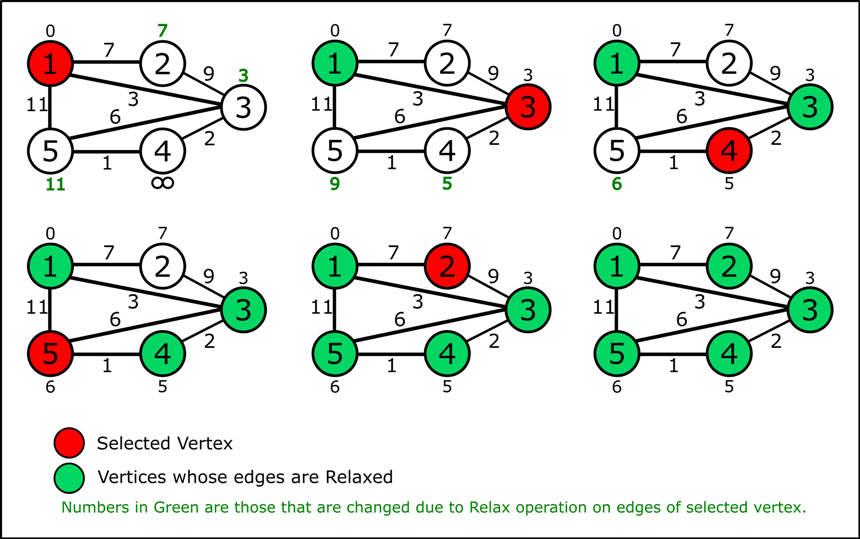

### Greatest Common Divisor
GCD-Greatest Common Divisor of 2 numbers ‘x’ and ‘y’ can be defined as the largest number that divides both a and b with remainder zero.


*Photo by [Mandy Choi](https://unsplash.com/@mandddysweettt?utm_source=unsplash&amp;utm_medium=referral&amp;utm_content=creditCopyText) on Unsplash*


### Regular Approach:
Most basic idea to find GCD of 2 Numbers can be try to divide both numbers with all the numbers smaller than both the numbers starting from 1 and the largest number that divides both the numbers with remainder zero will be the GCD of those Numbers. This approach is simple and straight forward but it can be slow if smallest of two numbers is very large, Asymptotically we can say this approach takes O(n) time to compute GCD.




```cpp
int GCD(int x,int y){
    if(x==0 && y==0){
	return -1;	//GCD not defined
    }
    if(x==0 || y==0){
	return max(x,y);
    }

    int result=1;
    int smallerNum=min(x,y);
    for(int i=2;i<=smallerNum;i++){
        if(x%i==0 && y%i==0){
	    result=i;
	}
    }
    return result;
}
```

### Euclidean GCD Algorithm
Basic idea behind Euclidean GCD Algorithm is out of 2 numbers if we subtract the larger number by smaller number the GCD remains same i.e,
GCD(x,y)=GCD(x,y-x) where GCD(x,y) is GCD of a and b, and here y>x.
So, we keep on doing this till we get one number to be 0 then, other number will be GCD.
It can be written in terms of modular division instead of subtraction like 
				GCD(x,y)=GCD(x,y%x)
Here again we will get the GCD when one number becomes zero (when modular division gives 0), only difference in  these two is that second one converges very fast. Asymptotically it gives GCD in O(log(min(x,y)).

```cpp
int GCD(int x,int y){
    if(x==0 && y==0){
	return -1;	//GCD not defined
    }
    if(x==0){
	return y;
    }

    return GCD(y%x,x);
}
```
Another approach can be to factorize both numbers and product of common factors will be the GCD, but again this method will not be any better than the Euclidean GCD Algorithm.

### Complexity:
Regular Approach:
- Time Complexity = O(n)			
- Space Complexity = O(1)

Euclidean GCD:
- Time Complexity = O(Log(min(x,y))		
- Space Complexity = O(Log(min(x,y))) (Size of Recursion Stack)


